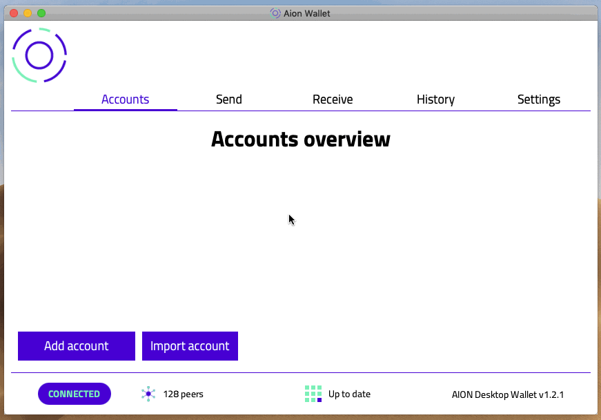

# Aion Desktop Wallet

Manage your AION coins using a local desktop application.

The Aion Desktop Wallet is a local application that allows you to create an Aion address and receive coins. The wallet is available for Linux, Mac, and Windows.

## Installation

Installation instructions and user guides can be found on the [Aion Docs website](https://docs.aion.network/docs/aion-desktop-wallet).

### Requirements

- Linux: `Ubuntu 16.04 LTS 64-bit` and higher
- Mac: `Mac OS High Sierra` and higher
- Windows: `Windows 10 64-bit`

## Features

- Generate a wallet specific to Aion (`m/44'/425'/0'/0'`).
- Create, manage, and export accounts.
- Import and export keystore accounts.
- Send and receive transactions.
- View transaction history.
- View the sync status of the node.

## Changelog

### New Features

- JKD 11 now supplied and supported. JDK 10 has been depricated.

### Bug Fixes

- Fixed NPM depencency issue.
- Fixed macOS boot issue that affected some users.
- Resolved JDK issue on Windows machines.