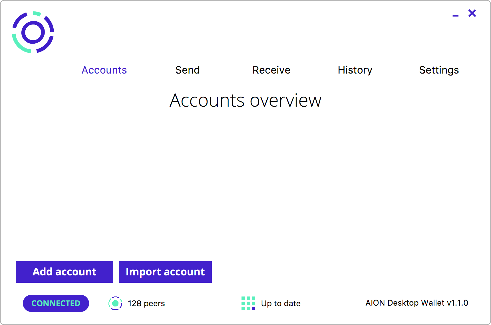

# Aion Desktop Wallet

Manage your AION coins using a local desktop application.

The Aion Desktop Wallet is a local application that allows you to create an Aion address and receive coins. The wallet is available for Linux, Mac, and Windows operating systems.

## Installation

Installation instructions and user guides can be found on the [Aion website](https://docs.aion.network/v1.1/docs/aion-desktop-wallet).

### Requirements

1. [Ubuntu 16.04](http://releases.ubuntu.com/16.04.5/)
1. [Aion v0.2.8 or higher](https://github.com/aionnetwork/aion/releases/latest)

## Features

* Ability to generate an HD wallet path specific to Aion (m/44'/425'/0'/0')
* Ability to create, manage and export accounts from HD path
* Ability to import and export keystore accounts
* Ability to send and receive Transactions (limited to currency transfers for now)
* Ability to view transaction history
* Ability to view the sync status of the node

## Latest Release

This release contains major changes to how _keystore_ files are managed, the method by which transactions are set, and how transaction history is maintained. You can download the wallet from the [Releases tab](https://github.com/aionnetwork/Desktop-Wallet/releases).
